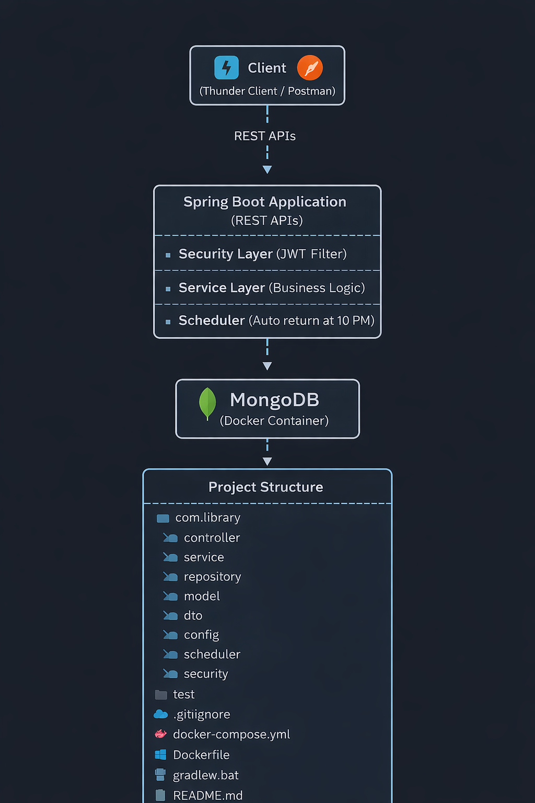

# Library Management System (Spring Boot + MongoDB + Docker)

A complete backend system for managing a library with authentication, role-based access, book borrowing, return policies, scheduler, and observability.

---

##  Features

-  JWT Authentication (Signup/Login)
-  Role-based access (ADMIN / USER)
-  Book Management
-  Borrow & Return System
-  Expiry-based auto return
-  10 PM Library Return Policy
-  Actuator Metrics & Health Monitoring
-  Dockerized MongoDB
-  Clean layered architecture

---

## Architecture



Client (Thunder Client / Postman)  
⬇  
Spring Boot Application (REST APIs)  
⬇  
- Security Layer (JWT Filter)  
- Service Layer (Business Logic)  
- Scheduler (Auto return at 10 PM)  
⬇  
MongoDB (Docker Container)

---

##  Project Structure

```
src/main/java/com/library
│
├── config
├── controller
├── dto
├── model
├── repository
├── scheduler
├── security
├── service
│
└── LibraryManagementApplication.java
```

---

##  Tech Stack

- Java 21
- Spring Boot
- Spring Security
- MongoDB
- Docker
- JWT
- Gradle
- Spring Actuator

---

## Setup & Run

### 1. Start MongoDB

```bash
docker-compose up -d
```

### 2. Run Application

```bash
./gradlew bootRun
```

---

## Authentication APIs

### Signup

**POST** `/auth/signup`

```json
{
  "name": "Rahul",
  "email": "rahul@gmail.com",
  "password": "rahul123"
}
```

---

### Login

**POST** `/auth/login`

```json
{
  "email": "rahul@gmail.com",
  "password": "rahul123"
}
```

 Copy JWT token from response

---

## Book APIs

### Add Book (ADMIN)

**POST** `/books`

Header:
```
Authorization: Bearer <TOKEN>
```

```json
{
  "title": "Spring Boot Guide",
  "author": "John",
  "libraryOnly": false
}
```

---

### Get All Books

**GET** `/books`

---

### Borrow Book

**POST** `/books/borrow/{bookId}`

---

### Return Book

**POST** `/books/return/{bookId}`

---

### My Books

**GET** `/books/my`

---

## Scheduler

- Auto returns expired books
- Enforces 10 PM return policy
- Runs using `@Scheduled`

---

## Monitoring

### Health

```
GET /actuator/health
```

### Metrics

```
GET /actuator/metrics
```

---

## Docker

```yaml
version: '3.8'

services:
  mongodb:
    image: mongo:6
    container_name: library-mongo
    ports:
      - "27017:27017"
    restart: always
```

---

## Testing

Use:
- Thunder Client (VS Code)
- Postman

---

## Notes

- JWT required for protected APIs
- ADMIN → add books
- USER → borrow/return
- Expired books auto-returned
- Old tokens won't have updated data

---

